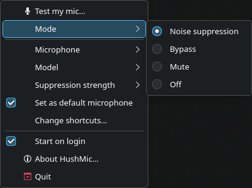
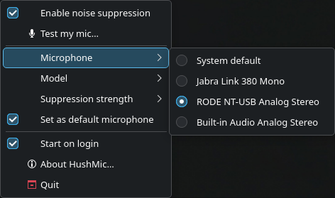
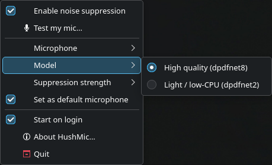
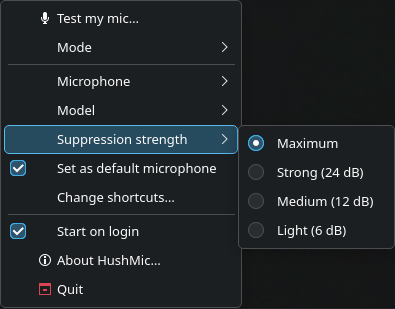
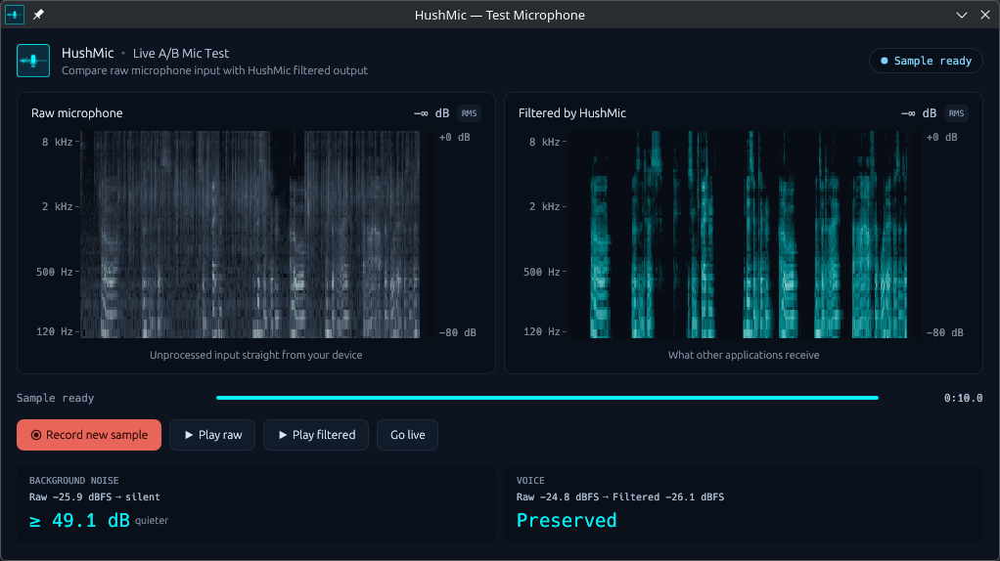

# Usage

## Launching

| command | what happens |
|---------|--------------|
| `hushmic` | tray icon plus the mic test window; a second launch reopens the window in the running instance |
| `hushmic --tray` | tray icon only; the autostart entry uses this |
| `hushmic --headless` | no icon, no window; see [headless.md](headless.md) |
| `hushmic --enable-once` | creates the virtual mic and waits for Ctrl+C; no watchdog, no CLI socket |
| `hushmic --doctor` | prints a diagnostics report and exits 1 when it finds problems |
| `hushmic --version` | version and install paths |

Only one instance runs per session. Quitting removes the virtual mic and restores the previous default input if HushMic had changed it.

## Modes

| mode | virtual mic carries |
|------|---------------------|
| `suppress` | your voice, cleaned |
| `bypass` | your raw voice, same latency |
| `mute` | silence |
| `off` | nothing; the virtual mic is removed |

Switching between suppress, bypass and mute changes a control on the running chain, so your call stays connected. Mute silences the virtual mic only; an app that captures the physical microphone directly still hears you.

The tray icon shows the state: cyan while suppressing, gray in bypass, a red struck-through mic while muted, gray struck-through when off, and a warning badge on an error.

<details>
<summary>Menu screenshots</summary>

<p align="center">
  
  
  
  
</p>

</details>

## Microphone, model and strength

**Microphone** lists the capture devices PipeWire sees. *System default* follows whatever the system default input is, including when you plug a headset in. If your chosen microphone disappears, HushMic falls back to the system default and switches back when it returns.

**Model**: `dpdfnet8_48khz_hr` is the quality model, `dpdfnet2_48khz_hr` needs less CPU. Changing the model restarts the chain (a short gap on the virtual mic).

**Suppression strength** caps how much noise is removed, in dB: maximum (100), strong (24), medium (12) or light (6). Lower values keep more of the room sound. Model and strength are remembered per microphone.

## Test my mic

**Test my mic** in the menu opens a window with the raw microphone and the cleaned output side by side: scrolling spectrograms and level meters. It can also record a 10-second sample and play it back as *Play raw* and *Play filtered*, with measured before/after numbers. Without a display or GL, an audio-only record-and-playback test runs instead.



## Keyboard shortcuts

**Set up shortcuts…** in the menu opens your desktop's key-binding dialog for four actions: toggle mute, toggle bypass, push to talk (live only while held) and push to mute (silent while held). The compositor grabs the keys, so they work in any app. After the first setup the entry reads **Change shortcuts…** and opens the desktop's shortcut editor; the keys also show up in your system's keyboard settings.

This needs the GlobalShortcuts portal (KDE Plasma, GNOME 45 and later). Where it is missing, the entry stays hidden; bind the commands below in your desktop's shortcut settings instead. Starting HushMic from a terminal additionally needs xdg-desktop-portal 1.18 or newer so it can identify itself to the portal; app-menu and autostart launches do not.

## Command line

```text
hushmic status [--json]        what the running instance is doing
hushmic mode [STATE]           print or set: suppress | bypass | mute | off
hushmic toggle mute|bypass     enter the state, or leave it for the previous one
hushmic quit                   stop the running instance

hushmic config [--json]        every setting, one per line
hushmic config get KEY [--json]
hushmic config set KEY VALUE
hushmic config path
hushmic devices [--json]       microphones you can pass as `mic`
hushmic service install|uninstall   see headless.md
```

`status`, `mode`, `toggle` and `quit` talk to the running instance over a socket. Exit codes: 0 ok, 1 invalid usage or a failed command, 2 HushMic is not running. The `engine:` line in `status` (`quality model`, `light model`, `passthrough`; the JSON field `engine`) says which engine the chain is running right now: under CPU pressure HushMic falls back to the light model or to unfiltered audio and climbs back later, see [troubleshooting.md](troubleshooting.md#latency-and-cpu).

`config set` applies the change immediately while HushMic runs and writes it to the file otherwise, with the same validation either way. `config` and `config get` read the running instance's settings when there is one, else the file. `toggle mute` twice returns you to the state you came from, so one key can serve as a mute button.

## Configuration

The file is `~/.config/hushmic/config.toml` (`hushmic config path` prints the exact location). Set keys with `hushmic config set KEY VALUE`:

| key | values | default | applied |
|-----|--------|---------|---------|
| `mic` | a node name from `hushmic devices`, or `default` | `default` | live |
| `model` | `dpdfnet8_48khz_hr` or `dpdfnet2_48khz_hr` | `dpdfnet8_48khz_hr` | live, restarts the chain |
| `attn_limit` | 0 to 100 (dB), or `maximum`, `strong`, `medium`, `light` | `100` | live |
| `set_default` | `true` or `false`: make HushMic the system default input | `false` | live |
| `autostart` | `true` or `false`: desktop autostart entry | `false` | live |
| `tray` | `true` or `false`: register a tray icon | `true` | next start |
| `notifications` | `true` or `false`: desktop notifications | `true` | live |

Booleans also accept `on`/`off`, `yes`/`no` and `1`/`0`. `tray = false` hides the icon; a plain `hushmic` launch still opens the window, so use `--headless` when you want neither.

The file also holds `enabled` (set with `hushmic mode`), `mic_prefs` (model and strength per microphone) and `shortcuts_setup`, all managed by the app. `tray` and `notifications` are only written when false, `mic_prefs` when non-empty and `shortcuts_setup` when true, so a file from an older version stays unchanged.

`SIGTERM`, `SIGINT` and `SIGHUP` all stop HushMic cleanly. There is no reload signal; use `hushmic config set`.
